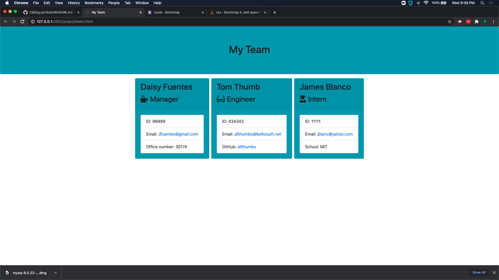

# Employee Template Engine

## Description

This is a NodeJS command line application that allows you to build a team of interns, managers and engineers. After entering all your team members by answering a series of questions, an html page will be created as a visualization of the team you just entered.

## Application Screenshot

## Application Demo

https://youtu.be/ZASZJ47S8tE

## Installation

download all files to local machine. Ensure NodeJS is installed as well as npm and Inquirer. Navigate to application folder via command line. Execute the app using "node app.js"

## Technologies

NodeJS, NPM, inquirer

## Credits

NodeJS developers
NPM Developers
Inquirer Developers

## License

Licensed under the [MIT](LICENSE) license
